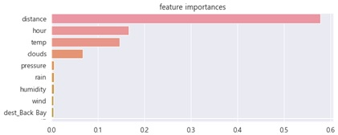
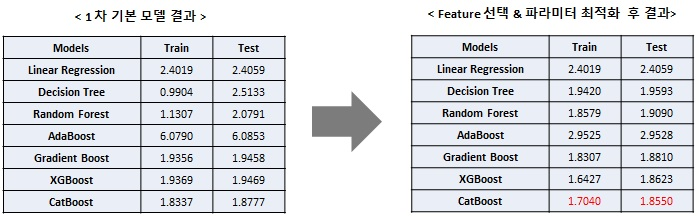

# Uber data analysis

### 1. About Uber : https://ko.wikipedia.org/wiki/%EC%9A%B0%EB%B2%84

### 2. 요약

- Uber의 차량운행관련 데이터 분석 및 운임 예측을 목표
- Data Set : 2018년 11 ~ 12월의 5분단위 차량운행 데이터와 1시간 단위 기상(weather) 데이터

### 3. 모델정의 및 평가

- 사용알고리즘 : Linear / Decision Tree / Randomforest / Gradients Boost / XGBoost / CatBoost / AdaBoost
- 평가척도 : MSE

### 4. 결과

- feature importance

  

- Prediction

  

※ Data set & Refernces : https://www.kaggle.com/ravi72munde/uber-lyft-cab-prices

